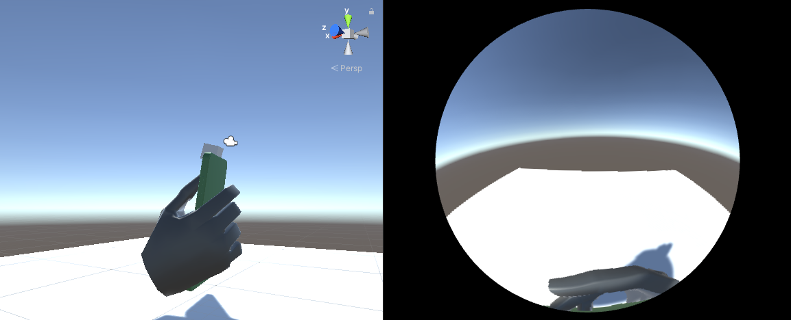

# fisheye-synthetic-image-generator
This repository is for generating large-scale synthetic fisheye images in Unity, aiming to provide training data for back-of-device interaction using fisheye camera. Each image is a synthetic fisheye camera view of a hand model holding a phone, with the camera located at the top of the phone. 

### Quick Start
1. Download Unity and add the project.
2. Open each scene to preview hand model's fisheye image.
3. To automatically generate synthetic image with different position (relative to the camera), open scene \Assets\Scenes\Hand1 and *play* the scene.The hand model update position in every 1 second. 
    * To save synthetic image, press *Key k* to capture the screenshots and save to folder.
    * To change hand's X, Y, Z position range, modify [RandomMove.cs](https://github.com/szellen/fisheye-synthetic-image-generator/blob/main/Assets/Scripts/RandomMove.cs)
    * Currently, the hand movement update script is only added to hand model 1, but same idea can be applied for all hand models (might need to change to X, Y, Z range to make the hand grip looks realistic). To generate more representative image, hand rotation, finger length, hand size, and background needed to be considered and added in the future. Joints data needed to be recorded and updated according to modification (Joints data can be founded by expending *Hands* prefeb in each scene).
    
### File structure
* Hand models: \Assets\hand model
* Synthetic image generation script: \Assets\Scripts
* Generation scene: \Assets\Scenes
* Generated image: \screenshots

### Acknowledgement
Fisheye camera in Unity was developed by [*KeunwooPark*](https://github.com/KeunwooPark) in [*fisheye_mesh_generator*](https://github.com/KeunwooPark/fisheye_mesh_generator) and [*Unity-Fisheye-Example*](https://github.com/KeunwooPark/Unity-Fisheye-Example) projects. The idea of generating synthetic image using Unity is inspired by [DeepFisheye](http://kwpark.io/deepfisheye) project. 
